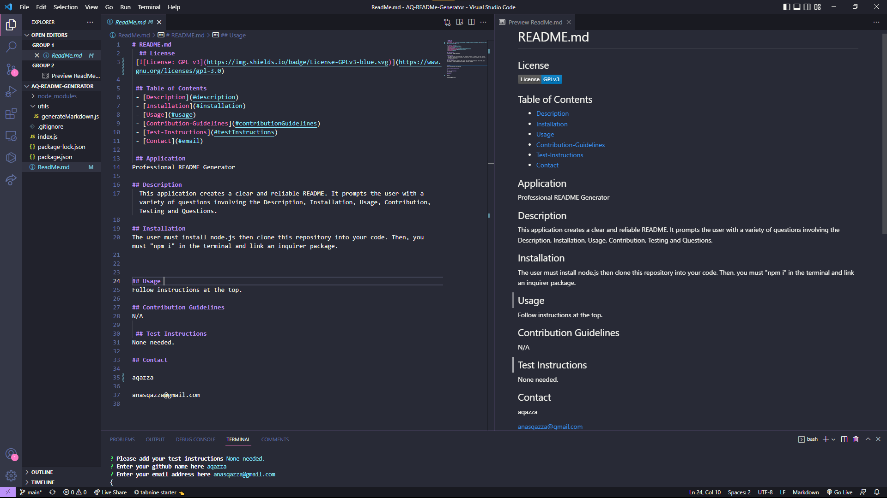

# README.md
  ## License 
 

 ,

 ## Table of Contents
 - [Description](#description)
 - [Installation](#installation)
 - [Usage](#usage)
 - [Contribution-Guidelines](#contributionGuidelines)
 - [Test-Instructions](#testInstructions)
 - [Contact](#email)
 
 ## Application
Professional README Generator

## Description
  This application creates a clear and reliable README. It prompts the user with a variety of questions involving the Description, Installation, Usage, Contribution, Testing and Questions.

  

## Installation
The user must install node.js then clone this repository into your code. Then, you must "npm i" in the terminal and link an inquirer package.

  
## Usage 
Follow instructions at the top.

## Contribution Guidelines
N/A

 ## Test Instructions
None needed.

## Contact 

github.com/aqazza

anasqazza@gmail.com 
